# Lab. #4 - Securing Cloud Native Applications

In this step, you will secure your Cloud Native Apps using the Web Application Firewall! This service allows us to protect our application from from malicious and unwanted internet traffic!

- 🌀 [Official OCI WAF page](https://www.oracle.com/security/cloud-security/web-application-firewall/)
- 🧾 [OCI WAF documentation](https://docs.oracle.com/en-us/iaas/Content/WAF/Concepts/overview.htm)

**You'll learn the entire step-by-step of this implementation.
 - [Pre Reqs](#PreReqs)
 - [Step 1: Create the WAF policiy](#Passo1)
 - [Step 2: Test the XSS script](#Passo2)
 - [Step 3: Test the Country/Region policy ](#Passo3)

 - - -

 ## <a name="PreReqs"></a> Pre Reqs

 1. [Log in](https://www.oracle.com/cloud/sign-in.html) to your OCI account

 2. Run the labs [Lab. #1](../Lab.%20%231%20-%20Resource%20Provisioning) and [Lab #2](../Lab.%20%232%20-%20Developing%20Cloud%20Native%20Applications%20-%20Parte%201).
 3. Get the Front-End Load Balancer name. In the 🍔 hamburger menu, go to: **Networking** → **Load Balancer**. Save the name of the Load Balancer associated with the Front-End of [Lab #2](../Lab.%20%232%20-%20Developing%20Cloud%20Native%20Applications%20-%20Parte%201)
    

 5. Click in the load balancer for the Front-end to access its detail page.
 
 7. Change the listener of the load Balancer to HTTP Protocol. This will allow the WAF to connect properly with the load balancer. In the Load Balancer page, click in the **Listeners** link
    
 9. Click in the 3 dots button and click on **Edit**
     
 11. In the **Edit listener** change de Protocol to **HTTP** and click **Save changes**. This will take 1-2 minutes to make the change to the listener. Once the change is apply, continue with the Lab.
 
 That's it! We've fulfilled all the prerequisites for the lab!
 
 - - -

 ## <a name="Passo1"></a> Step 1: Create de WAF

 1. In the 🍔 hamburger menu, go to: **Identity & Security** → **Web Application Firewall**.
    
 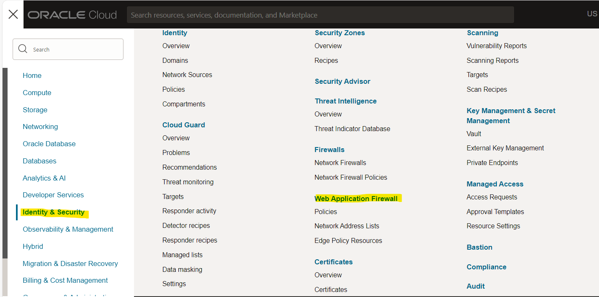

 2. In the Policies page click in the **Create WAF policy** button:
 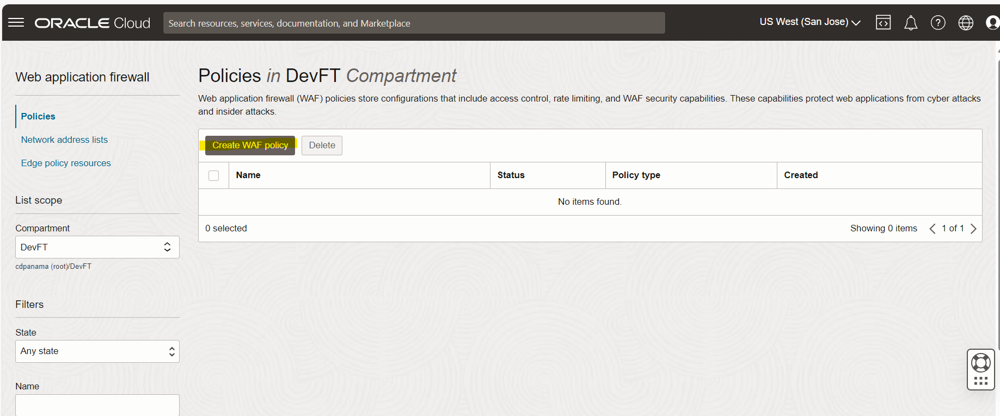
 3.  In the **Basic information** section write *FTWAF* as the **Name** and select the compartment, then click **Next**
    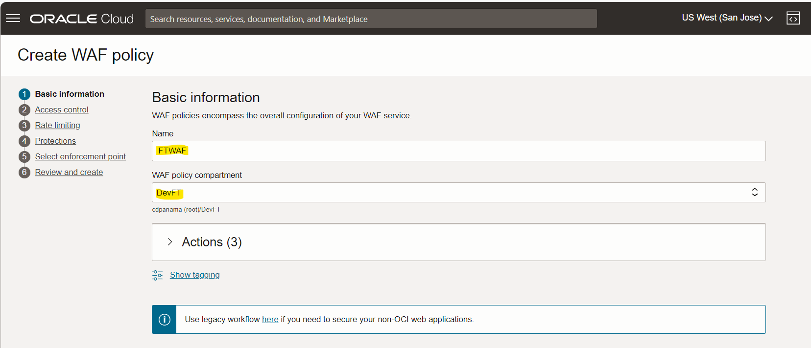
 5.  In the **Access control** section, enable access control and click in the **Add access rule** button.

 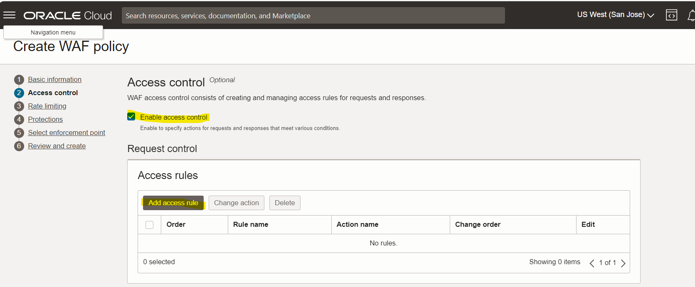
 
 6. In the **Add access rule** page, write the name *countryRule*, select *Country/Region* in the *Condition type* field, select *Not in list* in the *Operator* field and *Colombia* and *Mexico* in the *Countries* field. This will create a rule that only allows access from these two countries.
 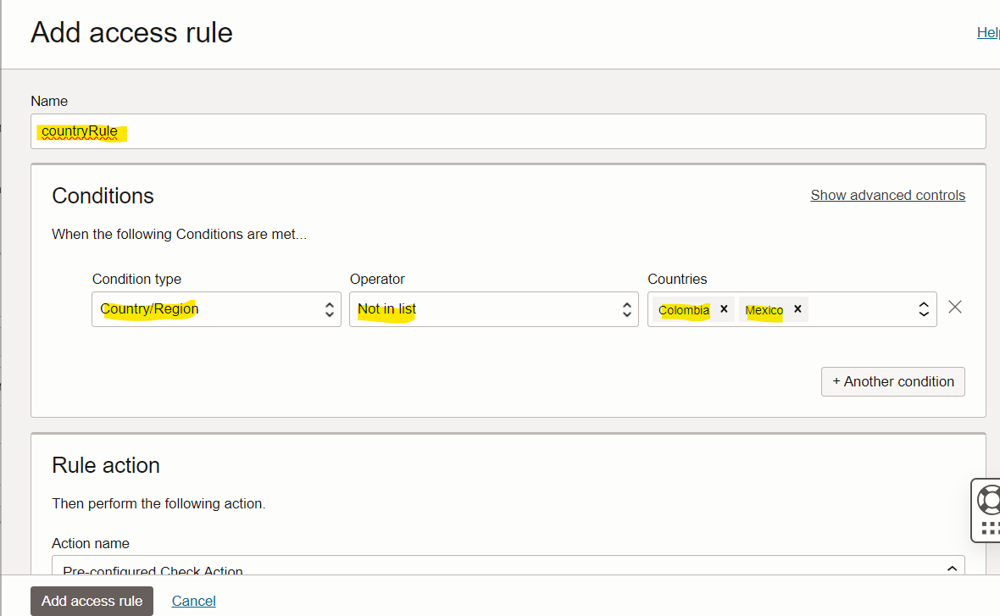
 7. In the **Rule action** section select *Pre-configured 401 Response Code Action* in the *Action name* field. This will return an error when the rule is satisfied. Then click in **Add access rule**.
 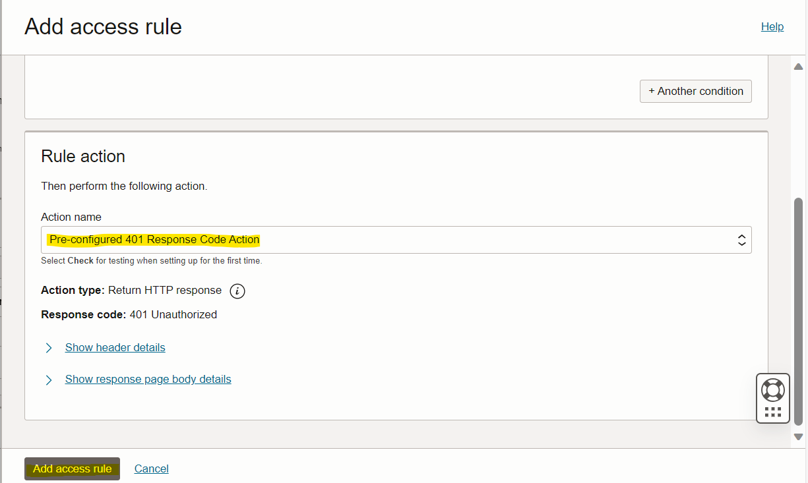 
 9. Then click on the **Next** button

 10. In the **Rate limiting** section just click **Next**
 11. In the **Protections** section, enable the configure protection rules and click in **Add request protection rule**
 
 13. In the **Add protection rule page** write *owasprule* as the name and in the **Rule action** section select *Pre-configured 401 Response Code Action*. This will return an error when the rule is satisfied.
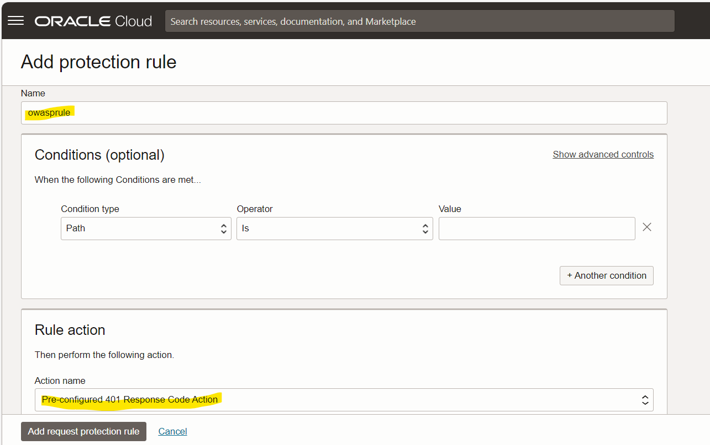

 14. In the **Protection capabilities** section click on **Choose protection capabilities**
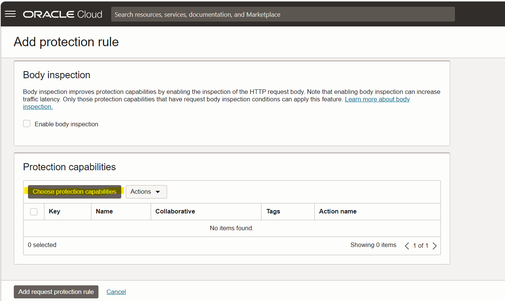
 15. In the **Choose protection capabilities** page in the *Filter by tags* select *OWASP-A10-2021* and leave the *Recommended* option added. Then click in the check box below to include all the protection capabilities. Then click in **Choose protection capabilities**. This will add all the protection capabilities needed to catch a variety of malicious traffic types, such as *XSS attacks* and *SQL Injection**. These capabilities run when the specified request and response conditions are met.

  
 17. Then click in **Add request protection rule** and click on **Next**
 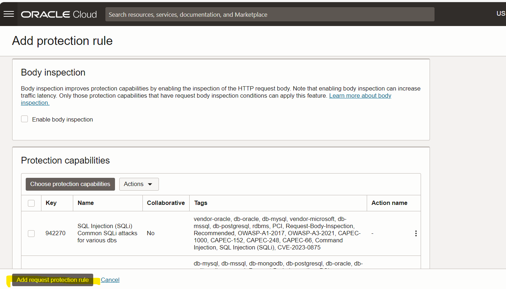
 18. In the **Select enforcement point** select the load balancer for the Front-end. Choose the name of the load balancer that we got in the PrePeqs of the lab. Then click **Next**
 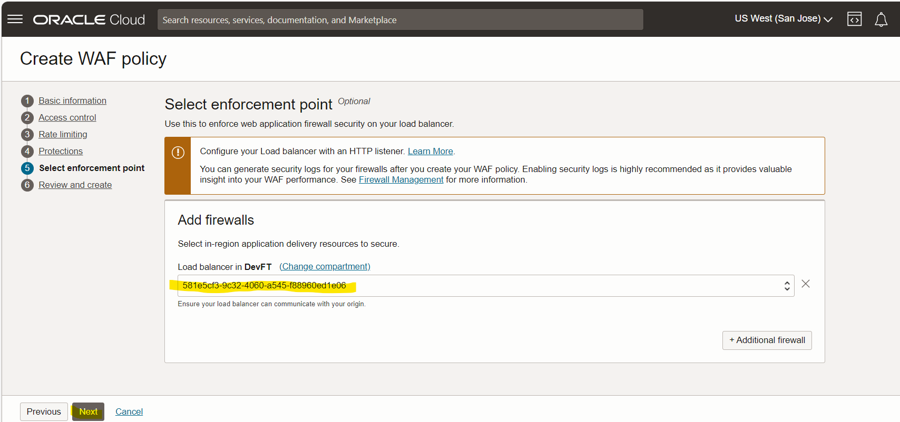
 19. Review the information and click in **Create WAF policy**
 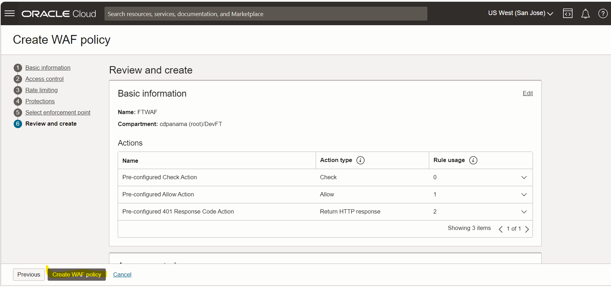
 20. The WAF policy should look similar to this
 


 ## <a name="Passo2"></a> Step 2: Test the XSS script

 1. Get the public IP of the Load Balancer associated with the Front-End app of [Lab #2](../Lab.%20%232%20-%20Developing%20Cloud%20Native%20Applications%20-%20Parte%201). In the 🍔 hamburger menu, go to: **Networking** → **Load Balancer**
    
    
 3. Copy the public IP in the browser to access the Front-End app. 
 

 3. We are going to try to execute a common attack known as *Cross-Site Scripting (XSS)*. Add the following script to the public IP in the URL

```bash
/?a=<script>alert('hacker');<script>
```
Example:

```bash
http://152.70.112.232/?a=<script>alert('hacker');<script>
```
4. Search the above URL and you will see that the WAF understands that this is a *Cross-Site Scripting* attempt and it will block it. Sometimes you have to refresh the browser a couple of times so the WAF identifies the attempt.

 


 
 ## <a name="Passo3"></a> Step 3: Test the Country/Region policy

 1. For this test we need a way to emulate that we are in another country different from *Colombia* and *Mexico*. To do that we can use a tool name *windscribe*. This will allows to emulate the request from another country in the world. You can add its extension to your browser and create a free account to use it. Once you have installed the tool you will have someting like this:
     
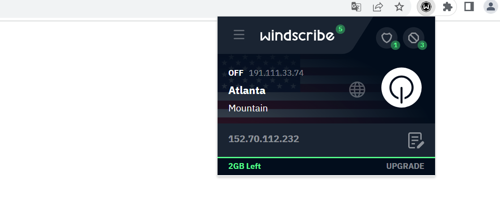


 2. To start the *windscribe* tool just select the country by clicking in the world logo and selecting for example *Atlanta Mountin* in the *US Central*.  

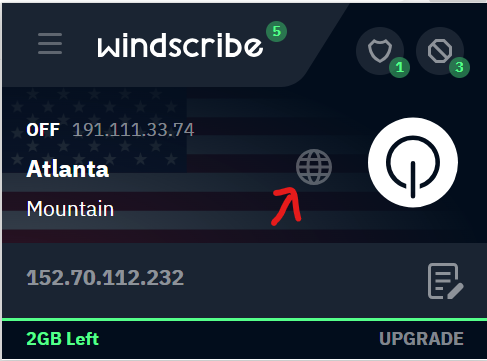
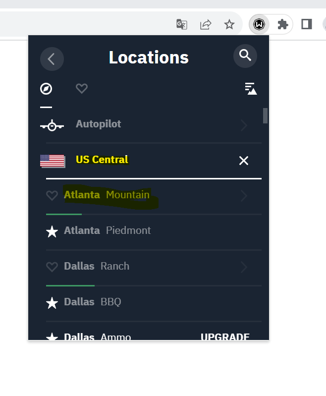

3. Then click in the *ON* logo to start the tool


4. Once started you can check your IP location by browsing to this website: **https://www.iplocation.net/**. Here you can check that your location has change
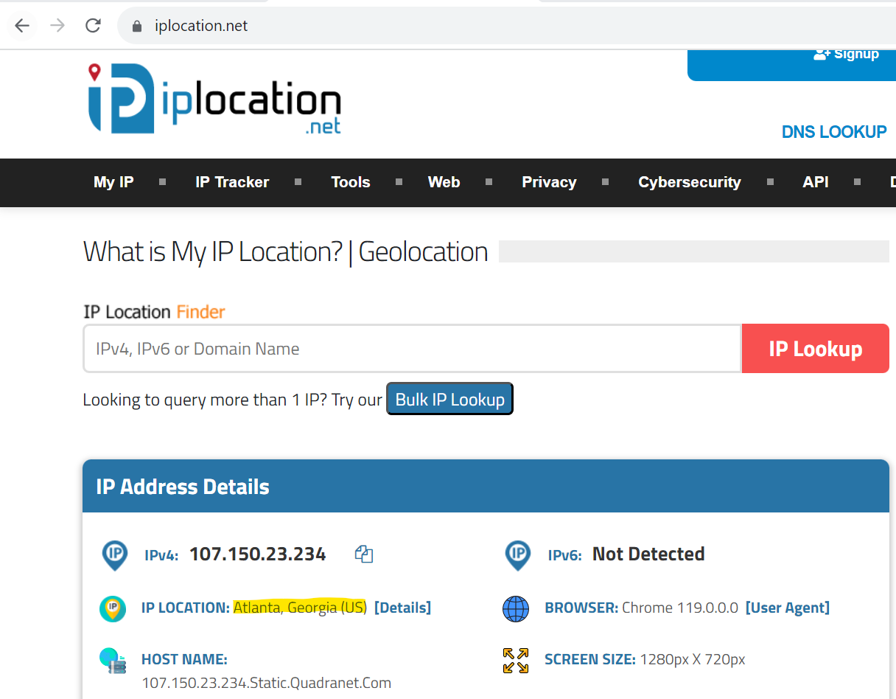

5. Then you can go to the public IP of the Front-End app and you will see that the WAF will block this request from *Atlanta*. Sometimes you have to refresh the browser a couple of times so the WAF identifies the attempt


### 👏🏻 Excelente!!! Protegiste tu App! Ahora puedes explorar más capacidades de este servicio de WAF en OCI! 🚀
